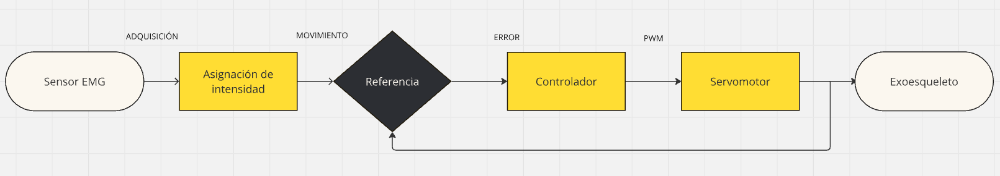

# PROYECTO FINAL EXOESQUELETO DE REHABILITACIÓN DE MANO
### Descripción del Proyecto
Este proyecto tiene como propósito diseñar y desarrollar un exoesqueleto de mano orientado a la rehabilitación de personas que han sufrido un accidente cerebrovascular (ACV). El dispositivo busca mejorar la eficacia y accesibilidad de la terapia de recuperación motora mediante un enfoque innovador que combina ergonomía, tecnología avanzada y fabricación accesible.El desarrollo sigue una metodología integral que abarca desde la identificación de las necesidades del paciente hasta la validación clínica del dispositivo. Inicialmente, se definen los requerimientos específicos del exoesqueleto, considerando los movimientos clave de rehabilitación, como la flexión y extensión de los dedos, ajustados a los rangos articulares recomendados por la fisioterapia. El diseño se basa en principios ergonómicos para garantizar que el dispositivo sea anatómicamente adaptado, cómodo y seguro para los usuarios. Además, se incorpora un sensor EMG para captar las señales musculares del paciente, permitiendo un control en tiempo real, y un actuador (servomotor) que asiste en los movimientos funcionales de la mano. Para optimizar costos y personalización, se opta por el uso de materiales compatibles con impresión 3D en la construcción del dispositivo. Esto facilita la fabricación de piezas adaptadas a la anatomía de cada paciente y reduce significativamente el costo de producción. Una vez definido el diseño preliminar, se procede a construir un prototipo que combina las piezas mecánicas con los componentes electrónicos. El prototipo se somete a pruebas iniciales para evaluar su funcionalidad, seguridad estructural y desempeño en un entorno controlado.
Finalmente, el exoesqueleto se validará en un entorno clínico, evaluando su efectividad en la mejora de la rehabilitación motora, así como su aceptación por parte de los pacientes y fisioterapeutas.
### Objetivos
### Objetivo General 
Desarrollar un exoesqueleto de rehabilitación de mano para personas con ACV en Bolivia, que permita mejorar la eficacia y accesibilidad de la terapia de recuperación motora, con un enfoque en la funcionalidad y monitoreo de los movimientos de la mano.
### Objetivos Específicos
- Diseñar la estructura mecánica del exoesqueleto de mano.  
- Implementar sensor EMG para controlar en tiempo real el rango de movimiento y la intensidad de los ejercicios realizados.
- Desarrollar un sistema de control y actuadores que permita al exoesqueleto asistir en los movimientos de flexión y extensión          funcionales.
- Integrar una interfaz para el fisioterapeuta que permita supervisar y ajustar los parámetros de la terapia.
- Evaluar la eficacia del exoesqueleto en un entorno clínico, validando su efectividad.
### Descripción general del sistema  
El sistema completo se compone de 4 subsistemas principales: detección del movimiento, 
asignación de referencia deseada, controlador y el exoesqueleto. El sistema comienza con la 
utilización de los electrodos del módulo de EMG colocados sobre el brazo del usuario, para 
detectar cuando se realiza algún movimiento, mediante la adquisición de señales EMG. 
Previamente se realiza una asignación de la intensidad o modo EMG para determinar qué tipo 
de movimiento se va a realizar al usuario en tiempo real. Ya que el movimiento es identificado, 
se asigna un valor a las posiciones deseadas del motor, previamente fuera de línea mediante 
captura de movimiento es posible determinar la trayectoria que cada una de las falanges necesita 
recorrer para realizar cierta acción. En el momento en que la trayectoria es asignada, el motor 
que se encarga del movimiento de los dedos del exoesqueleto se accionan, en conjunto con el 
sistema de control se debe seguir la referencia. En la Figura se muestra el diagrama a bloques 
general de todo el sistema. Como se observa en el diagrama, la función del sistema de control 
es primordial en el desarrollo del proyecto, ya que de tener un controlador que no cubra los 
requisitos del sistema es posible lesionar al usuario. 

### Intensidades y detección de activación muscular.  
La gestión de la estimulación motora mediante el exoesqueleto de rehabilitación se 
organiza en tres niveles de intensidad predefinidos y un modo basado en señales 
electromiográficas (EMG), ajustados según la sensibilidad aplicable requerida para el 
inicio de la terapia. 
Durante el proceso de muestreo para determinar las intensidades, el sistema permanece 
inicialmente en un estado de espera. A través de la interfaz, se selecciona el nivel de 
intensidad deseado, además el tiempo de espera y la serie a realizar, antes de iniciar el 
movimiento de flexión. De manera similar, al completar la flexión, espera el tiempo 
programado antes de realizar la extensión y regresar a la posición inicial. Este ciclo se 
repite continuamente hasta que la interfaz complete la serie programada, momento en 
el que el sistema regresa al estado de espera, y al finalizar muestra un mensaje de 
confirmación.
### Intensidad 1

### Intensidad 2

### Intensidad 3/Modo EMG

## Rango de movimiento por intensidad. a) Intensidad 1 (35°). b) Intensidad 2 (50°). c)Intensidad 3 (70°) 
En el modo EMG, es esencial identificar el momento preciso en que el usuario comienza 
a mover la mano, para limitar el tiempo de muestreo a intervalos que contengan 
exclusivamente la información relevante sobre la activación muscular. Durante el 
reposo, las señales EMG presentan valores cercanos a cero; sin embargo, al iniciar un 
movimiento, la amplitud de las señales aumenta notablemente. Para evitar 
interferencias, se ha establecido un intervalo de muestreo cada 25 segundos. 
Al igual que en los niveles de intensidad predefinidos, el modo EMG comienza en 
estado de espera y se activa a través de la interfaz de igual manera proporcionando un 
patrón adaptado a la detección de activación muscular del usuario. 
### Diseño de la interfaz gráfica de usuario
La interfaz 
fue desarrollada en Visual Studio utilizando Python, estableciendo comunicación UART entre 
Arduino IDE y Python para integrar las funciones del exoesqueleto. 
La pantalla principal de la GUI como se muestra en la Figura está dividida en cuatro secciones 
principales:
## a)

## b)

## a) Pantalla inicial de la Interfaz Gráfica de Usuario. b) Pantalla secundaria de controles principales. 
## c)

## d)

## c) Pantalla selección de intervalo y serie. d) Mensaje de confirmación. 
